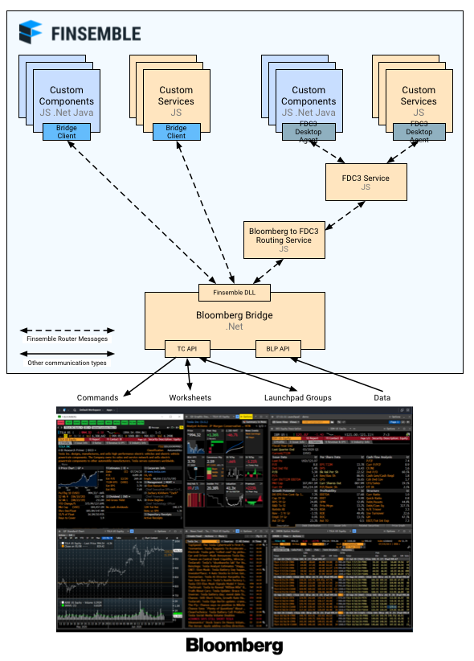

[fpe-bloomberg](README.md) › [Globals](globals.md)

# fpe-bloomberg

[](https://documentation.chartiq.com/finsemble/)

## Finsemble's Bloomberg Terminal Connect Integration
Welcome to Finsemble's integration with [Bloomberg Terminal Connect](https://www.bloomberg.com/terminal-connect/), which enables Finsemble components and services to interoperate with Bloomberg panels or Launchpad components, allowing you to build powerful workflows for your users that avoid data re-entry and copy/paste errors.

Specifically, the integration enables:
- Finsemble to execute command functions in a Bloomberg Panel
- Bi-directional data sharing between Bloomberg worksheets and Finsemble
- Bi-directional data sharing between Launchpad groups and Finsemble
- Search functions for Bloomberg secreadurity definitions (as provided by the SECF function), e.g. `TSLA US Equity` or ``

By using this integration with Finsemble, you can provide these capabilities to your applications. Your Finsembilized components can drive context in the Bloomberg Terminal or react to context changes received from it.

To use the integration you will need access to both a Bloomberg Terminal and license for Terminal Connect. For more information on Terminal Connect, run `TMCT`**\<GO\>** in your Bloomberg terminal. For help designing your integration, contact the Finsemble [Solutions Engineering team](mailto:support@finsemble.com). 

## Table of Contents
- [How it works](#how-it-works)
- [Installation](#installation)
  * [Files](#files)
  * [Installation via the watch script](#installation-via-the-watch-script)
  * [Manual installation](#manual-installation)
- [Building and Deploying the Bloomberg Bridge](#building-and-deploying-the-bloomberg-bridge)
  * [Prerequisites](#prerequisites)
  * [Build the integration](#build-the-integration)
  * [Producing an appAsset for deployment by Finsemble](#produce-an-appasset-for-deployment-by-finsemble)
- [Use Cases](#use-cases)
  * [Data sharing with Launchpad groups](#data-sharing-with-launchpad-groups)
  * [Data sharing with worksheets](#data-sharing-with-worksheets)
  * [Searching for Securities](#searching-for-securities)
  * [Send commands to the Bloomberg Terminal](#send-commands-to-the-bloomberg-terminal)
    + [The anatomy of a Bloomberg command](#the-anatomy-of-a-bloomberg-command)

## How it works
The integration is comprised of a native (.Net) bridge application that acts as a Desktop service for communicating with the terminal via Terminal Connect and the BLP API. The Bridge application exposes an API via the Finsemble router for which a [Typescript client class](src/clients/BloombergBridgeClient) is provided. The client can be imported into Finsemble Javascript components or custom desktop services that you build. The client may also be used as a preload, where it will be added into FSBL Object as `FSBL.Clients.BloombergBridgeClient`.

The native bridge application must be running before calls to Terminal connect can be made, and can be launched either manually or on startup via a Finsemble component configuration. 

**REPLACE ME**


A number of examples of using the integration are provided:
- **[Bloomberg Bridge](src/components/Bloomberg%20Bridge)**: Example component configurations for launching the native bridge application.
- **[testBloomberg](src/components/testBloomberg)**: A test component demonstrating use of all API functions.
- **[Bloomberg Terminal](src/components/Bloomberg%20Terminal)**: An example configuration for launching the Bloomberg terminal itself
- **[TBC: Desktop service for FDC3 integration](#)**: An example service that works with the FDC3 channel matcher service to facilitate context sharing with FDC3 system channels in Finsemble and provides an example of instrument/security translation that may be required. See the [Finsemble FDC3 Implementation](https://github.com/ChartIQ/finsemble-fdc3) project for more details on the FDC3 channel matcher service.
- **[TBC: Security finder example](#)**: An example that demonstrates the use of the SecurityLookup function of the Bloomberg Bridge to implement a search with typeahead for Bloomberg sercurities, which may be used to set the context of launchpad groups.

## Installation
This project contains:
- A .Net solution for building the Bloomberg Bridge
- a Typescript client to work with the API exposed by Bloomberg Bridge 
- a number of javascript examples, such as a test component and an example service for integrating BBG LaunchPad groups with FDC3 channels.
- a watch script that can install the proejct files in a copy of the Finsemble seed project for you.

Please note that the Bloomberg bridge must be deployed to your users machines for use, see [Producing an appAsset for deployment by Finsemble](#produce-an-appasset-for-deployment-by-finsemble) for instructions on creating an asset and details of how Finsemble can deploy the asset for you. 

In order to use the Javascript and Typescript examples, you can either copy the relevant files to your Finsemble seed project manually or use the supplied watch script to do so. Note the watch script will also deploy the example BloombergBridge build provided.

### Files
```
fpe-bloomberg
|   .gitignore                   - gitignore file configured for both javascript and .Net projects
|   BloombergIntegration.sln     - Visual studio solution for building the .Net Bloomberg Bridge app  
|   finsemble.config.json        - Watch script config and Finsemble examples config imports 
|   finsemble.manifest.json      - Example Finsemble manifest entry for a deployed copy of the bridge app
|   LICENSE                      - Finsemble developer license
|   package.json                 - Package.json file for the client and examples
|   README.md                    - This file
|
|───BloombergBridge              - Project for building the .Net BloombergBridge
|   |   BloombergBridge.cs        
|   |   BloombergBridge.csproj   
|   |   SecurityLookup.cs 
|   |
|   └───bin                         - build output directories
|       └───Release
|       └───Debug
|
|───fpe-scripts
|       watch.js                     - Watch script for copying project files into a Finsemble project
|
|───hosted
|       BloombergBridgeRelease.zip   - Example BloombergBridge build packaged for use ans an appAsset
|
└───src                           - Typescript client and example Javascript component source directory
    |
    └───clients
    |   └───BloombergBridgeClient        
	|           BloombergBridgeClient.ts - Typescript client class and preload for use with BloombergBridge
	|
    └───components
    |   └───Bloomberg Bridge         - Congfigs for launching the Bloomberg Bridge
    |   └───Bloomberg Terminal       - Example config for launching the Bloomberg terminal
    |   └───testBloomberg            - Test component demonstrating use of all API functions
	|
    └───services                     
        └─── ??
```

### Installation via the watch script
When run, the watch script deploys all files to the configured Finsemble seed project directory and then watches for any changes in the _/src_ directory. When folders or files are added or removed this will be automatically reflected in the Finsemble Seed Project. *finsemble.config.json* and finsemble.manifest.json are also observed for changes and will update the seed project's main _/configs/application/config.json_ and _/configs/application/manifest-local.json_ files if they change.

To use the watch script:
1) Clone the Finsemble [seed-project](https://github.com/ChartIQ/finsemble-seed) (if you don't already have a local version - see our [Getting Started Tutorial](https://www.chartiq.com/tutorials/?slug=finsemble))
2) Clone this repo
   - **our advice:** clone this repo to the same directory as the seed-project e.g *myfolder/finsemble-seed* & *myfolder/finsemble-fdc3*
3) If you clone in a different location, open **finsemble.config.json** and update `seedProjectDirectory` with the path to your local Finsemble Seed Project.
4) Run `npm install` then run `npm run watch` **this will continue to watch for file changes, this can be stopped once all the files have been copied to the seed project approx. 30 seconds*
5) Your seed project directory has now been updated with the 

### Manual installation

## Building and Deploying the Bloomberg Bridge
The Bloomberg Bridge application should be built using Terminal COnnect and BLP API DLL files distributed by Bloomberg. It can then either be deployed to a known path on your users machines, or delivered via a Finsemble app asset, which will be downloaded and installed automatically by Finsemble.

An example appAsset for the Bridge is provided in _/hosted_ directory.

### Prerequisites
- Visual Studio 2017 (or later) and .Net Framework 4.5.2+
- Finsemble.dll: Installed automatically via NuGet when using Visual Studio to build the integration.
- Bloomberglp.TerminalApiEx.dll
  - To download from Bloomberg Terminal, run `TMCT` **\<GO\>**
  - Click Software Downloads
  - Follow instructions to install, default location: _C:\blp\TerminalAPISDK_
  - Add either the 32bit or 64bit DLL in the _lib_ or _lib.x64_ to your project as a reference.
- Bloomberglp.Blpapi.dll
  - Download the BLP API C# (.NET) Supported Release for Windows from the [Bloomberg API library](https://www.bloomberg.com/professional/support/api-library/) page.
  - Add the _/bin/Bloomberglp.Blpapi.dll_ DLL as a reference to your integration's project.

### Build the integration
- Open the BloombergIntegration.sln in Visual Studio.
- Add the previously downloaded DLLs as referneces to the Bloomberg Bridge  project, specifically:
  - Terminal Connect API (Bloomberglp.TerminalApiEx.dll)
  - BLP API (Bloomberglp.Blpapi.dll)
- Rebuild the project (which will install NuGet dependencies automatically)

### Produce an appAsset for deployment by Finsemble
- Run a Release build
- Create a zip file from the contents of the _BloombergBridge/bin/Release_ directory and name it appropriately
- Host the build at an appropriate URL (or if using the watch script and testing locally, add it to the _hosted_ directory of the project)
- Configure Finsemble's manifest file (e.g. _/configs/application/manifest-local.json_) with an appropriate appAssets configuration of the form:
	```JSON
	{
		...
		"appAssets": [
			...
			{
				"src": "http://localhost:3375/hosted/BloombergBridgeRelease.zip",
				"version": "1.0",
				"alias": "bloomberg_bridge",
				"target": "BloombergBridge.exe"
			}
		],
		...
	}
	```

  N.B. Finsemble will only download and deploy a new version of the asset if it does not have a copy of the asset that was downloaded via an app asset with the given version number. 

## Use cases
### Data sharing with Launchpad groups
### Data sharing with worksheets
### Searching for Securities
### Send commands to the Bloomberg Terminal

#### The anatomy of a Bloomberg command
Each Bloomberg command is made up of:
- Mnemonic: The specific command that would normally be entered into the Terminal (e.g., DES, YAS, VCON)
- Panel: The Bloomberg panel number to send it to
- Securities: (0 or more Bloomberg security strings)
- Tail: Arguments specific to the mnemonic (optional) - See the help page in the Terminal for each mnemonic to discover what options it supports
