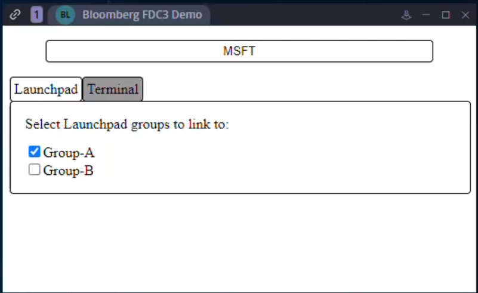

# Bloomberg to FDC3 Example

This is an example app demonstrating interoperability between Bloomberg Terminal Connect API 3 and your apps using Finsemble's BloombergBridgeService and FDC3.

See [Integrating Bloomberg Terminal Connect](https://documentation.finsemble.com/docs/add-apps/bloomberg/integratingBloomberg) for instructions on setting up the Bloomberg Bridge service, configuring your API key, enabling Bloomberg, and enabling your app to use the BloombergBridgeClient.  

## The Launchpad tab

The Launchpad tab demonstrates two-way communication between apps in Finsemble and Bloomberg Terminal connect using the linker.



This tab demonstrates:
- Listening for instruments broadcast via FDC3 and setting the Launchpad group accordingly.
- Listening for changes in the Launchpad groups' securities and using FDC3 to broadcasting the appropriate context to linked apps.  
- Listening for changes to the actual Launchpad groups themselves and taking an appropriate action (in this updating the list of groups). 
- Searching for a security in Bloomberg

## The Terminal tab

The Terminal tab sets up automatic relays that listen for intents, changes in launchpad and take the specified action.

[Add image of the terminal tab here]

This functionality on this tab hooks into of the capabilities of the Bloomberg Bridge Service. This tab works by creating a list of relays stored in the Finsemble user preferences. The preferences are picked up by the Bloomberg Bridge service where it is acted upon. This is a simplified version the Bloomberg preferences tab.

The functionality capable from this tab:

- Listening for when an intent is raised and relaying that

## Running the example

On the command line, from the root of the project, `cd fdc3` into the example's folder and run `npm install`. Run `npm run dev`.
This will run and serve the example from a local server, the default should be `http://localhost:5173/`.

### Finsemble Config

The example is now ready to be run in the Finsemble environment. Add the example to Finsemble by adding the config below to apps.json and start Finsemble. 

**Note:** The preload in the config below may not be required. See the section on [Configuring your app to use BloombergBridgeClient](https://documentation.finsemble.com/docs/add-apps/bloomberg/integratingBloomberg#configuring-your-app-to-use-bloombergbridgeclient) for more information.

```json
{
    "appId": "BloombergFDC3Demo",
    "name": "Bloomberg FDC3 Demo",
    "type": "web",
    "details": {
        "url": "http://localhost:5173/"
    },
    "hostManifests": {
        "Finsemble": {
            "component": {
                "preload": ["$moduleRoot/preloads/BloombergBridgePreload.js"]
            }
        }
    }
}
```

